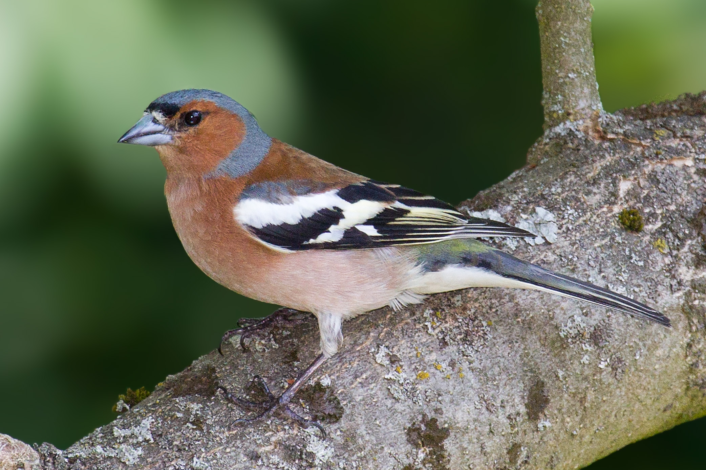

```{r setup, include=FALSE}
knitr::opts_chunk$set(echo = FALSE,
                      warning = FALSE,
                      message = FALSE,
                      fig.retina = 3)
# default code
```
```{r packages}
# install packages
#install.packages("kableExtra")
#install.packages("flextable")
#install.packages("gt")
#install.packages("devtools")

library(tidyverse)
library(rmarkdown)

# install RefManageR and citr from github
devtools::install_github("ropensci/RefManageR")
devtools::install_github("crsh/citr")

library(RefManageR)
library(citr)
# code for package loading


```
# Introduction

Chaffinches are very abundant in Britain, it's pattern helps it to blend into the environment when it is feeding on the ground [@Slater_1979]. The wingspan of a chaffinch is 24.5-28.5cm and the mass is 18-29 grams [@Marler_1956]. Males (see figure \@ref(fig:chaffmale-fig)) and females (see figure \@ref(fig:chafffemale-fig)) have different appearances.

(ref:chaffmale-fig) Male Chaffinch on a branch. By Photo © Andreas Trepte, CC BY-SA 2.5, https://en.wikipedia.org/wiki/Common_chaffinch

(ref:chafffemale-fig) Female Chaffinch on a branch. By Photo © Andreas, CC BY-SA 2.5, https://en.wikipedia.org/wiki/Common_chaffinch

```{r chaffmale-fig, out.height="200px", fig.cap='(ref:chaffmale-fig)'}

```

```{r chafffemale-fig, out.height="200px", fig.cap='(ref:chafffemale-fig)'}
knitr::include_graphics("pics/Chaffinch_female.jpg")
```

# Methods

```{r import}
#import dataset
chaff <- read.table("raw_data/chaff.txt", header = TRUE)

```
```{r tidy}
#tidy data
library(tidyverse)
chaff2 <- gather(chaff, key = sex, mass)
```
```{r SS(x)}
sum_sq <- function(df, measure, group) {
  df %>% group_by({{ group }}) %>% 
    summarise(ss = sum(({{measure}} - mean({{measure}}))^2))
}

sum_sq(chaff2, mass, sex)
```

```{r summary}
chaffsum <- chaff2 %>% 
  group_by(sex) %>% 
  summarise(mean_chaff = mean(mass),
            sd_chaff = sd(mass),
            se_chaff = sd(mass)/sqrt(length(mass)),
            sample_size = length(mass))
# summarise data
```
We measured the mass of male and female chaffinches.
We used R [@R-core] with tidyverse packages [@tidyverse] for all analyses and the rmarkdown [@markdown1] and bookdown [@bookdown] packages for manuscript preparation.


# Results

```{r extract}
# extract values for inline reporting

highestmean <- max(chaffsum$mean)
highestse <- chaffsum$se[chaffsum$mean == highestmean]
highestspp <- chaffsum$species[chaffsum$mean == highestmean]
lowestmean <- min(chaffsum$mean)
lowestse <- chaffsum$se[chaffsum$mean == lowestmean]
lowestspp <- chaffsum$species[chaffsum$mean == lowestmean]

```
```{r testing}
mod <- aov(data = chaff2, mass ~ sex)

# extract values for inline reporting
res <- summary(mod)[[1]]
fval <- round(res$`F value`[1], 2)
df1 <- res$Df[1]
df2 <- res$Df[2]
p <- round(res$`Pr(>F)`[1], 3)
```

There is a significant difference in mass between sexes (_F_ = `r fval`; _d.f._ =`r df1`, `r df2`; _p_ = `r p`). 
I've also gratuitously included a table with the same information just for the sake of including a table. See Table \@ref(tab:summary-table).

```{r summary-table}
knitr::kable(chaffsum,
             digits = 2,
             caption = 'A summary of the data.',
             row.names = FALSE)
```

(ref:sex-fig) Mean Mass of Chaffinch. Error bars are $\pm 1 s.e.$

```{r sex-fig, fig.height=4, fig.width=4, fig.cap="(ref:sex-fig)"}

ggplot() +
  geom_point(data = chaff2, aes(x = sex, y = mass),
             position = position_jitter(width = 0.1, height = 0),
             colour = "gray50") +
  geom_errorbar(data = chaffsum, 
                aes(x = sex, ymin = mean_chaff - se_chaff, ymax = mean_chaff + se_chaff),
                width = 0.3) +
  geom_errorbar(data = chaffsum, 
                aes(x = sex, ymin = mean_chaff, ymax = mean_chaff),
                width = 0.2) +
  scale_y_continuous(name = expression("Mass "*g), 
                     limits = c(0, 25), 
                     expand = c(0, 0)) +
  scale_x_discrete(labels = c("Male", "Female"), 
                   name = "Chaffinch Sex") +
  annotate("segment", x = 1, xend = 2, 
           y = 72, yend = 72,
           colour = "black") +
  annotate("segment", x = 2, xend = 2, 
           y = 72, yend = 70,
           colour = "black") +
  annotate("segment", x = 1, xend = 1, 
           y = 72, yend = 70,
           colour = "black") +
  annotate("text", x = 1.5,  y = 74, 
           label = "*", size = 8) +
  theme_classic() +
  theme(axis.title = element_text(size  = 10),
        axis.text = element_text(size = 10))

```

# Discussion


# Bibliography 